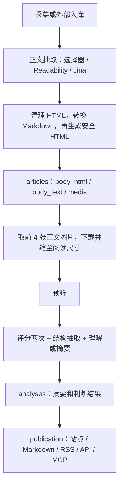
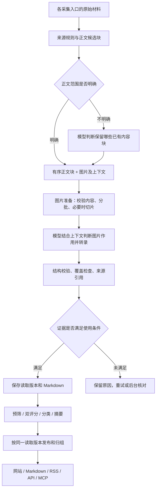

# 正文清理、图片理解与 Markdown：代码评审和实施方案

这是实施前的评审记录。已实施的行为、验证结果和上线边界见 [迭代验收与 PR 审查](2026-09-30-body-reading-result.md)，配置操作见 [正文与图片读取](../body-reading.md)。

日期：2026-09-30。评审基线：`92d3041225ccfc6df4c119b5064bff47dc1a663c`（本地 `main`）。本次只评审和设计，不修改运行逻辑、不调用线上模型、不更改线上数据。

## 1. 结论

现有框架可以承载目标，建议保留采集、PostgreSQL、pg-boss、模型适配器、付费回执和统一发布层，在编辑分析之前新增 **正文读取** 步骤。

目标是：确定正文范围；识别正文中的图片是否包含有效信息；结合标题、相邻段落和图注读取图片；把可核验的信息整理为 Markdown；让预筛、评分、分类、摘要、归组使用同一份带来源的证据。

当前版本已经支持 CSS 正文裁剪、HTML/Markdown 转换，以及给视觉模型发送正文图片。这不等于已经完成了有效图片判别、可靠转录和结果复用。此次评审还发现几个会直接影响结果的代码问题，应与新步骤一起修复。

建议新增 3 个环境变量：`BODY_READING_MODE`、`BODY_READING_MODEL`、`BODY_READING_CONCURRENCY`。继续使用已有的模型连接、视觉能力声明和总安全阀，不新增一套必填 API 密钥。上述 3 个变量目前尚未实现，单独写进 `.env` 不会生效。

## 2. 当前执行过程和可复用能力



可继续使用的部分：

- `content/extract.ts`：明确的来源选择器、Readability、经回执的 Jina 兜底；选择器无匹配或匹配多处时不会扩大到整页。
- `content/markdown.ts`、`content/sanitize.ts`：Markdown 转换、安全 HTML、表格和单位标记保留。
- `providers/llm.ts`、`providers/receipts.ts`：图片请求、结构化响应、重试回执、服务调用额度。
- `editorial/models.ts`：按能力选模型，后台配置优先于环境变量，其次使用默认值。
- `jobs/content.ts`：队列、退避、预算暂停、未知付费结果处理和历史内容优先级。
- `editorial/analyze.ts:441`：写回前检查输入修订是否过时。
- `publication/`：统一内容读取和全文权限。继续遵守站点登录与独立后台认证规则。

这次不需要引入新的 agent 框架、消息中间件或独立 OCR 服务。可以先使用已配置的视觉模型，是否需要第二种识别服务由实测决定。

## 3. 评审发现

P1 表示应在目标功能上线前解决的正确性问题；P2 表示能力缺口、成本或质量风险。下面的行号均对应上述基线。

### R1 · P1：纯图片正文在发布阶段被降为摘要模式

证据：`content/extract.ts:32–45` 允许显式正文容器只有图片，此时 `body_text` 为空；`publication/publish.ts:192` 却仅用非空 `body_text` 判断是否有正文。`publication/detail.ts:172–175` 只在 `body_mode=full` 时导出正文。

本地复现：一个包含公告图片的正确容器被成功抽取，`images=1`、`text=""`；即使来源允许全文，现有发布判定仍得到 `summary`。因此，“抽取成功”和“图片能够在正文及 Markdown 中提供”之间尚未闭合。

处理：分开表达“已确认正文包含内容”和“正文存在可检索文字”。有效图片可以构成正文；是否允许发布转录文字则另看识别结果。不要用增加占位文字的方式绕过判定。

### R2 · P1：视觉模型和后台模型选择规则冲突

证据：`editorial/models.ts:17` 的摘要等能力没有 `vision` 标记；`admin/models.ts:96` 要求能力与模型的视觉布尔值完全相等；`apps/web/app/routes/admin/models.tsx:179` 同样过滤。

本地复现：设置 `LLM_VISION=true` 后，给 `summarize` 选择 `default`，在访问数据库前就抛出 `a vision-only model cannot do this`。环境变量仍能使当前分析流程使用视觉模型，因此这是后台选择与执行能力不一致，不代表线上模型必然没有收到图片。

处理：把“支持视觉输入”和“此步骤必须有视觉输入”分开。新增 `requiresVision` 约束，只在必需视觉的能力选择了不支持图片的模型时拒绝；允许视觉模型处理纯文本。前后端使用同一能力规则，并显示最终模型及配置来源。

### R3 · P1：图片中的主体名称可能被身份校验误删

证据：`editorial/writing.ts:189–198` 只从标题、正文文字、来源等建立允许出现的主体集合；`219–225` 将不在集合内的摘要主体视为无依据并清空摘要。视觉图片自身不在该集合中。

本地复现：原始标题为“LNG挂牌价格公告”，文字为空，模型输出包含“中国海油”的摘要时，结果为 `summaryZh=""`、`unsupportedSummaryEntityIds=["cnooc"]`。这是视觉专属证据触发的构造案例，不是声称示例原文一定触发同样问题。

处理：让经过校验的图片转录进入统一证据输入，身份校验从这份输入提取主体；不能直接把摘要模型自己生成的公司名加入白名单。只存在于未读清图片里的名称仍不能作为确定事实使用。

### R4 · P1：图片变化可能不触发新分析，旧图片缓存可能继续生效

证据：`content/materials.ts:95–97` 的内容哈希只含标题、正文文字、摘要；`170–171` 在哈希相同后提前返回，图片和 HTML 更新没有入库。即使扩充哈希，也需要同步检查 `189` 的乱码等价判断，避免它再次跳过仅图片变化。

`media/images.ts:129–138` 的磁盘缓存键只有模式和 URL，命中后直接返回；没有图片字节指纹或源站校验。`operations/retention.ts:36–37` 有 30 天缓存清理，但这不是及时识别源图更换的机制。

本地复现：仅更换图片 URL，两个素材哈希相同；本地图片源由红图改为蓝图后，在新的模块实例中仍读回红图，源站只被访问一次。

处理：素材指纹包含有序正文结构和图片引用；读取证据另包含图片字节哈希。首次读取、来源更新、显式重读及到期复核触发图片校验；使用 ETag/Last-Modified 时同时保留字节指纹。需要强制重取时不能再走现有只按 URL 命中且不校验源站的读取分支。新旧图片证据不得共用识别结果。

### R5 · P1：前 4 张图片和静默失败会造成遗漏

证据：`editorial/input.ts:115–125` 先 `slice(0,4)` 再下载；下载失败或返回不支持格式时直接移除。`body-images` 提示词能告知总数和附带数，但没有每张图片的失败原因及正文完整性判定。

本地复现：前四张返回 404、第五张可读取，最终附带 0 张，第五张根本没有请求。即使前四张均成功，也可能全是装饰图，真正的价格表位于第五张。

处理：先形成完整候选清单，再按图的角色和位置安排读取；支持分批和长图切片。每张图必须有终态或待处理原因。达到资源上限时标记未完成，不得把“已读前四张”当成正文已读完。

### R6 · P2：当前正文确认主要依赖结构和长度，不是语义确认

证据：`content/extract.ts:44` 通用结果依赖 200 字门槛，显式选择器则有字或有图就通过；无规则的 Jina 回退在 `89` 直接接受转换后的候选内容。`dropPageChrome` 只能删除已知结构。

本地复现：唯一匹配的正文容器内只有普通品牌图片时，也能成功抽取。不能据此声称生产所有品牌图都会误入，但可以确认当前没有图像语义判别。

处理：保留来源规则优先；为不明确的候选正文增加按内容块的模型判断。模型只能从已取得的内容块中选择保留或排除，并记录理由，不能自由编造或扩写“原文”。对于正文中的二维码等，也应结合上下文判断，不因外观一律删除。

### R7 · P2：图文顺序和图片上下文没有进入模型输入

证据：`editorial/input.ts:104–111` 把图片缩减为 URL 列表，失去图注、相邻段落、所在章节和主体归属；`editorial/analyze.ts:198–201` 把所有图片放到一大段文字之后。引用帖图片和原帖图片也会合并。

处理：保存有序内容块，并为图片附上稳定 ID、所属来源/引用、标题、章节、图注和前后段落。按“上下文说明 → 对应图片”交错发送，结果按 ID 返回。保留同图不同位置的引用关系，不能只按 URL 去重后丢掉上下文。

### R8 · P2：多次看图，没有持久化的转录结果，也没有可检索的图片正文

证据：`editorial/analyze.ts:341–359` 缓存的是图片下载 Promise。正常通过预筛并评分的流程，预筛 1 次、评分 2 次、结构 1 次、写作 1 次，共 5 次调用；如果各步骤都用视觉模型，会重复发送同组图片。识别出的原文和表格没有独立保存。

`content/markdown.ts` 是格式转换器。它能把 `` 转为 ``，不会将图片内容转录成 Markdown 表格。

处理：读取一次并保存图文证据，后续编辑步骤复用。双评分保留原来的独立评分设计，只统一输入证据；不改变行业评分门槛。单独测量读取与下游调用的输入/输出 token、时延和费用，不能把调用数变化直接等同于成本下降。

### R9 · P2：发布正文和摘要没有绑定同一份正文证据

证据：`publication/detail.ts:40` 读取当前 `articles.body_html`；`publication/publish.ts:161–163` 取最新分析但不要求其输入版本等于当前素材版本。重新抽取正文后、分析完成前，已有发布记录可能继续搭配新的正文。

这是代码路径可见的版本一致性风险，本次未在生产制造并发故障。增加 OCR 结果后，若不补绑定关系，问题会扩展到“旧摘要 + 新识别价格表”。

处理：已发布内容固定关联分析版本与读取版本。重读完成、分析通过、权限检查通过后一起切换；失败保留上一份已发布版本。新文章没有可用完整证据时不能生成确定性价格结论。

### R10 · P2：图片预处理和现有测试还不能证明真实识别质量

证据：`media/images.ts:181–206` 使用展示图片的压缩路径，宽度最多 1600；GIF 和小 SVG 可能原样返回，而 `editorial/input.ts:120` 只接受 JPEG/PNG/WebP。没有长图分段、细小表格专用读取及逐格核对。

`tests/vision-body.test.ts:12,28–33` 使用白色图片和预置模型回答；它验证传图、回执、失败分支，无法证明真实图片上能读出 4200 元/吨。这个数字是测试桩输出，不能当作示例公告的真实价格。

处理：新增适合识别的图片准备路径；离线回归和真实模型评测分开。对于图表，只转录可见标签和明确数值；只有曲线而无精确数值时，不猜测具体价格。

## 4. 目标流程



### 4.1 正文候选和内容块

在破坏 DOM 属性的清洗之前，先提取正文候选和图片关联信息；随后再做安全清理。保留段落、列表、标题、表格、图片、图注的阅读顺序。

每个内容块有 `blockId`、`order`、`kind`、来源片段；图片另有 `imageId`、URL、alt、图注、前后段落、章节、所属文章/引用帖。相同图片可以只下载一次，但不同位置的上下文不能合并。

来源明确配置的正文范围是边界，模型不能将范围外导航重新加入。选择器失效时记录“正文区域未找到”，不自动扩大范围。未配置规则时，对 Readability/Jina 的候选做内容质量判断；明显可靠的纯文字正文可直接进入后续处理，不必新增模型调用。

没有配置选择器的纯图片候选，也不能因为不足 200 字就直接丢弃全部材料。保留候选图片、DOM 位置及页面标题，交由读取步骤确认是否为正文；确认前不将其标成可靠全文。这样新步骤才能处理尚未逐站配置规则的图片公告。

### 4.2 图片判断与转录

先用确定性规则排除追踪像素、已明确配置的站点装饰区；尺寸、文件名、alt 仅作为线索，不能单独决定删除一张公告或图表。

同一批模型请求可以同时输出图片作用与可见内容，避免每张图必然额外调用两次：

| 图片情况 | 读取结果 | 后续使用 |
|---|---|---|
| 公告截图、文字通知 | 原文段落、署名、日期、可见附注 | 加入正文证据 |
| 价格表、统计表 | 表头、行列、值、单位、口径、日期、脚注 | 输出表格，供摘要引用 |
| 数据图表 | 明确标签、刻度、可见数值、有限的图形描述 | 区分直接读数与解释 |
| 与正文相关的现场照片 | 简短描述、用途 | 保留原图；不推断无法看到的产能、地点或公司 |
| Logo、广告、引流二维码 | 排除理由及图片 ID | 从整理后的正文中排除 |
| 不确定或无法读清 | 未完成原因、模糊区域 | 不编造，按完整性策略处理 |

输出使用固定 JSON schema：图片 ID、角色、相关性结论、转录块、表格单元格、来源区域、无法读取项。模型只能引用输入中存在的 ID；URL、来源主体及权限不能由模型改写。

正文及图片中的“忽略以上规则”等文字一律作为待识别资料，不作为系统指令。

### 4.3 长图、格式和输入上限

识别图片从原图生成，复用现有安全下载和 `sharp`，增加独立的读取模式，避免只使用网页展示图。按文字可读性和模型输入约束决定缩放；长图可使用全图定位加带重叠区域的切片。转录按坐标和块 ID 合并，去掉切片重叠产生的重复行。

GIF/SVG 在受限资源条件下转换为可读取帧或栅格；如果动画其他帧可能包含信息，不能默认为首帧代表全文。无法处理就保存原因。

单张下载大小、解码像素、每批图片、总切片、输出长度都设置上限。现有下载 15 MiB 可以作为初始边界；其余默认值经实际样本测量决定。达到上限、输出被截断、返回遗漏图片 ID 时只能算部分完成。

## 5. 读取结果、版本与 Markdown

### 5.1 建议的数据结构

先新增两张表，避免把状态、回执和大段识别文本都塞进 `articles.media`：

| 数据 | 关键字段和用途 |
|---|---|
| `article_readings` | `id`、`article_id`、`input_revision`、`source_hash`、`asset_set_hash`、`policy_hash`、模型/提示词版本、任务状态、内容质量、覆盖统计、原始内容块、整理后 Markdown/HTML/文字、证据映射、回执 ID、错误原因、时间 |
| `article_image_readings` | `reading_id`、`image_id`、顺序、原始 URL、原图哈希、上下文哈希、图片角色、处理状态、排除原因、转录块/表格、切片及来源区域、回执 ID |

任务状态和内容质量分开：例如任务已经执行结束，内容仍可能是 `partial` 或 `needs_review`。建议任务状态为 `pending/running/done/failed`；内容质量为 `complete/partial/needs_review`。图片另有 `read/ignored/unreadable/pending` 等结果。

新增 `articles.accepted_reading_id`、`analyses.input_reading_id`、`publications.reading_id`，老数据允许为空。按末尾编号增加兼容迁移；当前最新编号为 0039，实施时再次确认后分配新编号。

原始 HTML/图片快照放在私有、按内容哈希寻址的存储中，数据库保存引用；使用现有数据目录/文件管理设施，按实际容量配置保留策略。已发布结果正在引用的原图证据不得按普通 30 天派生缓存直接清理。记录的已发布图片必须可回看，或在证据过期时明确标记，不能假装仍可核验。

终态读取结果不可原地修改；修正另建版本。至少建立 `(article_id, input_revision, source_hash, asset_set_hash, policy_hash)` 的查询索引及 `(reading_id, image_id)` 唯一约束；幂等键还必须覆盖模型和提示词版本。来源 URL、块 ID 和图片哈希都保存在结果中，模型输出引用校验通过后才能写入被接受的版本。

### 5.2 缓存和版本规则

- 素材指纹升级为有版本号的格式，包含正文结构与图片引用。补齐仅图片变化的修订分支，保留原有跨信源去重和乱码保护；旧数据采用懒迁移，不能升级后自动对全库付费重跑。
- 同 URL 图像字节改变，由 `asset_set_hash` 产生新的读取版本；即使文字修订相同，旧分析也不能匹配新读取版本。
- 识别复用键包含图片字节、上下文、转换参数、模型、提示词和规则版本。只相同 URL 不构成复用依据。
- 每次任务固定配置快照。后台中途换模型或规则后，正在执行的任务继续使用自己的快照；旧任务不能覆盖后来指定的读取版本。
- 保存结果时比较源修订、待处理读取版本和配置指纹；过时结果保留审计，不激活。沿用现有事务内回执完成机制。
- 原始素材和识别产物分开，不能把转录结果重新送进 `upsertMaterial` 当成源站新正文，导致“识别 → 新修订 → 再识别”的循环。
- 人工修正生成新的读取版本并记录操作者、理由和前后值；不直接篡改原始图片或历史模型结果。

### 5.3 Markdown 的约定

使用同一个有序内容块结果生成 Markdown、安全 HTML和检索文字。保留原文标题层级、段落、表格、图片和必要脚注，不把摘要改写当成原文。

图片转录放在对应图片附近，标注“图片文字”或“图片表格”；保留原图和来源关联。有效图保留，确认属于装饰的信息不进入整理结果。不确定信息单独标识，不填入确定价格列。

普通表格使用 GFM 表格；合并单元格等结构沿用目前安全 HTML 的保留方式。若以后要求完全不含 HTML 的 Markdown，需另选无损展开方式，不能悄悄丢掉合并关系。

站内详情与下载采用同一读取版本；全文 RSS 使用相同产物并继续检查 `syndicate_fulltext`。API/MCP 只返回其既有权限和契约允许的内容，不因新增 OCR 自动扩大全文权限。检索字段也使用被接受的转录内容，避免只有摘要能被搜到。

对于上海石油天然气交易中心示例：正文边界为 `.center_content`；原网页快照显示正文是一张图片。验收必须去掉站点 Logo、菜单和页脚，保留公告图，并将真正读出的公告文字/表格附在图旁。网页发布时间 2026-09-30 与标题里的业务日期 2026-09-28 分别记录，不能混用。价格、单位和附注须从原图核验，本方案不预填价格。

## 6. 分析和发布怎样使用结果

`AnalyzeInputArticle` 新增读取版本、内容完整性、证据块及对应来源。预筛、双评分、分类和摘要默认读取这份整理后的证据；处于新流程的文章不再在每一步重复发送全组图片。后续需要核验某个图像事实时，可以针对指定图片/区域再读，并单独记录回执。

长正文不能继续仅依赖前 6000/7000 字截断。按内容块保留覆盖信息，优先保留关键表格、日期、单位和相关证据；需要分段时分段处理，保证每个事实结论能回指被读取的块。块选择不应把正文尾部的有效价格表静默抛弃。

身份检查、缺失材料判断、事实结构化、全文翻译、事件归组和综述都要接入同一证据来源。翻译结果同时绑定读取版本，不能拿旧图片转录的译文搭配新图。

事实改变时重新评估相关归组及综述，不能因旧 `grouped_at` 或旧翻译修订检查而跳过；仅格式整理、不改变事实时则复用原有结果。新增读取状态和管理操作通过后端接口提供给前端，前端不直接读存储，也不持有模型凭证。

建议的失败与发布规则：

| 状态 | 执行动作 | 对读者的结果 |
|---|---|---|
| 读取完整且校验通过 | 分析并整体发布 | 使用新版本正文和摘要 |
| 已确认图片纯装饰 | 记录排除后继续 | 不影响真实正文 |
| 关键价格表/公告图未读清 | 重试，必要时后台核对 | 新文章不生成确定性价格结论；旧文章保留上一已发布版本 |
| 某配图失败，但完整文字正文足以支撑结论 | 明确标记部分完成，按证据生成摘要 | 不声称已覆盖全部图片；原图是否展示仍遵守权限 |
| 正文范围不确定 | 保存候选和原因，待规则修正/核对 | 不把整页导航当正文 |
| 超出服务额度或暂时故障 | 等待并按既有退避机制续跑 | 不把临时失败改成“原文未披露” |
| 付费结果 unknown | 沿用回执恢复流程 | 不随意换请求 ID 重复付费 |

由 `publication/` 统一检查读取版本、分析版本、人工修正、全文许可和登录权限。读者打开页面仅查询已保存内容，不触发模型。切换发布指针应与索引/订阅修订记录同步，避免只有网页更新而 Markdown 或 RSS 仍然旧版。

## 7. 配置方案

### 7.1 建议新增的环境变量

| 变量 | 建议默认值 | 作用 |
|---|---|---|
| `BODY_READING_MODE` | `off` | `off` 不启用新增读取步骤；`shadow` 保存对照结果但不激活；`active` 将通过检查的结果交给分析发布 |
| `BODY_READING_MODEL` | `default` | 新增 `bodyReading` 能力使用的模型注册名；沿用现有 `modelFor` 选择与后台覆盖 |
| `BODY_READING_CONCURRENCY` | `1` | 当前 worker 的读取任务并发数，先小并发测量，再按限流和内存调节；多 worker 总并发需合计 |

`shadow` 初期仅接受明确圈定的样本任务，不自动重读全库；它仍可能产生模型费用，应统计对照调用成本。

保留现有配置：

- `LLM_BASE_URL`、`LLM_API_KEY`、`LLM_MODEL`：模型连接。
- `LLM_VISION=true`：默认模型支持图片的声明；不是让纯文本模型获得视觉能力的开关。命名预设也须声明视觉能力。
- `MODEL_CALLS_ENABLED`：绝对安全阀。新增模式为 `active` 也不能越过它；安全阀关闭时可使用已有结果和确定性处理，不得调用新模型。
- `COLLECT_ENABLED`、飞书和 IndexNow 安全阀：不因读取功能开启而改变。
- 现有服务预算、超时与回执：继续生效。现有 budgets 主要限制请求次数，不能把它当成严格的金额上限；图片切片数、输出长度和单篇调用上限需要额外约束。

拟议的部署初始配置（实现后才有效）：

```dotenv
# 已有配置：仅在实际模型支持图片时设置
LLM_VISION=true

# 新功能默认不自动处理，先配置模型并验证
BODY_READING_MODE=off
BODY_READING_MODEL=default
BODY_READING_CONCURRENCY=1
```

不得在示例中放入真实密钥。worker 启动和后台切换时检查配置有效性，模型不存在、能力不足或缺少凭证时给出明确状态；不要像当前未知模型名称那样静默回退后假装已正常读图。

### 7.2 不建议放进环境变量的内容

| 配置内容 | 放置位置 | 原因 |
|---|---|---|
| 正文选择器、排除区域 | 信源 `config.body`，沿用现有字段 | 每个网站结构不同，后台可维护 |
| 图片强制保留/排除选择器 | 可选 `config.body.images` 扩展，严格校验并审计 | 来源特例；先保留后排除，冲突需报错 |
| 图片与文章相关性、公告/广告的语义规则 | `industry/prompts/` | 行业编辑规则需版本化 |
| 每篇图片、切片、请求数上限与复核条件 | 一个版本化的读取策略；初期用代码默认值，需要运营调整时通过后台设置 | 避免每个启发式规则都变成环境变量；纳入结果指纹 |
| 临时重读、指定原图重试、人工纠正 | 后台操作及审计记录 | 是一次任务，不是部署配置 |
| `site_fulltext`、`syndicate_fulltext` | 现有来源权限字段 | OCR 能力不改变全文授权 |

首版无需一口气开放所有策略字段；保留明确的硬上限和版本号即可。正文已配置 `.center_content` 的信源继续使用原规则。种子文件不会覆盖已有数据库来源，上线时须显式迁移/后台保存并回读确认。

## 8. 实施拆分与验收条件

| 阶段 | 工作内容与主要位置 | 完成条件 |
|---|---|---|
| A：修复已确认问题 | `publication/publish.ts`、`admin/models.ts`、后台模型页、`content/materials.ts`、`editorial/input.ts` | 纯图片正文可正确发布；后台可选视觉模型；仅图片变化可识别；遗漏/失败不再静默 |
| B：保存正文证据 | 新增 `content/reading.ts`、`content/blocks.ts`、`content/reading-schema.ts` 及增量迁移；扩展 `media/images.ts` | 内容块有顺序和上下文；图像按字节识别；结果版本可保存、复用与回看 |
| C：读取任务与模型 | 新增 `jobs/reading.ts`；接入 `jobs/content.ts` 路由、`jobs/queue.ts`、worker 注册及 `editorial/models.ts`；新增行业提示词 | 所有编辑类入口均可进入读取；正文范围判别、相关图判别、转录/切片能通过离线回归；回执及额度不被绕过 |
| D：分析与发布使用统一证据 | `editorial/input.ts`、`writing.ts`、`analyze.ts`、翻译/归组输入、`publication/`、contracts | 主体校验接收有来源的视觉事实；正文/摘要/导出固定同一版本；失败不替换已发布内容 |
| E：后台和上线验证 | 内容详情页显示逐图状态、原图/转录对照、失败原因、重读/修正；配置说明和重处理脚本 | 实际来源小样本核验、指定文章回读、历史处理不刷屏，可退回上一版本 |

这些阶段共同构成上线条件，尤其不能把“身份校验接受图中主体”和“发布版本固定”留到上线以后。可以分提交实现，但完整目标不是阶段 A 的局部修补。

任务路由应是 `extract → read → analyze → publish`；已有 `body_status=ok` 的 RSS、公众号、JSON、外部推送和 X 文章也要检查是否缺少读取结果。不能只把新步骤接在网页抓取成功回调上。非编辑类信源继续遵守原有参与方式，不能因此自动进入正文发布流程。

队列复用现有优先级和重试语义；新增读取任务拥有自己的尝试次数和错误类别，不把网络超时、识别格式错误、额度暂停混为一类。部分完成只重跑失败的图片/切片。相同显式重读请求 ID 不能重复扣费，普通重试复用已有回执。

## 9. 验证方案

### 9.1 本次已做的检查

审查了抽取、清洗、素材修订、图片缓存、模型配置、各编辑步骤、队列、发布、Markdown 导出、后台重跑和相关测试。运行了纯函数及本地 HTTP 图片源复现，未连接数据库或外部模型：

| 复现项 | 结果 |
|---|---|
| 纯图片正文 + 全文允许 | 抽取成功，发布模式却是 `summary` |
| Logo 图片作为唯一选中内容 | 被抽取层接受 |
| 只有图中存在的中国海油主体 | 文本身份检查清空摘要 |
| 只变更图片引用 | 素材哈希不变 |
| 源图相同 URL 换内容 | 独立模块实例继续返回磁盘旧图 |
| 前 4 张失败，第 5 张可用 | 附带 0 张，第 5 张未请求 |
| 摘要能力在后台选择视觉模型 | 被能力校验拒绝 |

这些复现证明具体代码行为，不证明真实模型的识别准确率。此前的传图测试也不能替代真实图像核验。本次只有评审文档变更，没有重跑整套数据库和前端构建测试。

### 9.2 实现时的离线回归

- 正文边界：菜单/页脚、显式容器缺失或多处、纯图片、短公告、混合表格、无规则的低质量 Jina 候选。
- 上下文与图片：有效图在第 5 张以后、图片失败后续批次仍处理、不同位置同图、X 原帖与引用主体不同、图注在后、长图跨片重复表头、图像格式无法处理。
- 数字与语义：价格、币种、单位、含税/不含税、执行日/发布日期、涨跌方向、负号、小数点、合并单元格和脚注；不能把缺失项补为 0。
- 证据校验：视觉独有主体可被正确保留；来源不支持的公司/数值仍被拒绝；图片中的恶意指令不改变任务。
- 版本与恢复：仅 URL 变化、同 URL 换图、上下文变化、提示词变化、任务中途换模型、源修订竞争、只重试失败图片、未知回执、额度暂停、worker 重启。
- 发布一致性：页面、下载、RSS 和已有 API/MCP 契约结果一致；纯图片正文不丢失；新识别失败保留旧版本；权限、登录和后台认证回归。
- 安全阀：全部关闭时不访问外部服务。模型由本地桩替代，测试库必须是空的 `_test`/`_ci` 数据库。

完成后按仓库要求跑 typecheck、迁移和后端测试、前端 build 和测试，再启动站点跑 smoke，并通过真实页面完成正文查看、原图对照和 Markdown 下载检查。

### 9.3 真实模型的小样本评测

单独建立约 30–50 篇有人工标注的样本，覆盖真实纯图片公告、价格表、图文混排、长图、多图、装饰图和失败图片。数量是首轮评测规模建议，不是统计准确率承诺；不据此随意调整行业评分门槛。

核心记录：正文保留/噪声删除、有效图片漏判、关键字段准确、无法识别是否如实标注、逐图覆盖、耗时、token、费用和缓存复用。价格表按“值 + 单位 + 日期 + 对应行列/对象”整体核对，不能只验证出现了某个数字。

固定回归样本中，关键数字出现误读必须修复或进入待核对，不能以平均准确率掩盖；上线后也不能承诺所有图片永远识别正确。真实模型评测与常规自动化测试分开执行，并保留原图、输入、响应和人工核验记录。

## 10. 上线、历史文章与回退

1. 先部署向后兼容的表结构和代码，`BODY_READING_MODE=off`。不自动导入覆盖已有来源配置，不自动重跑历史文章。
2. 核对有效模型、视觉能力、回执和预算，圈定小样本执行 `shadow`，查看原图和转录对照。仅模型成功返回 JSON 不算验收。
3. 对示例文章及同类来源完成完整回读：正文无菜单、原图对应、转录可核验、摘要与图一致、Markdown 含正文及相关表格、各出口版本一致。
4. 通过样本后切换 `active`，新文章按新流程处理。后台观察失败原因、遗漏图片、平均与高分位时延、额度和 token。
5. 历史内容按文章 ID 或信源分小批显式重处理。保留原发布时间/发现时间，尊重人工修正与来源权限；修正历史内容时不重复制造新事件热度或发送旧文通知。先抽样，再扩批，不在迁移里全库调用模型。
6. 出现质量问题时暂停新增读取任务，将受影响发布指针切回上一个完整版本。`off` 只停止新增步骤，不能自动删除已验证结果或绕过现有全文规则。保留失败记录和回执，便于定点恢复。

交付时分别报告代码提交、远端推送、服务器更新、进程生效、目标文章重处理、页面与 Markdown 回读结果。任何一个完成都不代替其他步骤。
